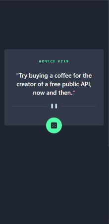

# 💡 Advice Generator App

A simple React-based app styled with Tailwind CSS that fetches and displays random advice from the Advice Slip API. Built as part of a [Frontend Mentor](https://www.frontendmentor.io) challenge to improve API handling, React component structure, and UI styling.

---

## 🚀 Live Demo

👉 Coming Soon!

---

## 🛠️ Built With

- **React** – JavaScript library for building interactive user interfaces
- **JavaScript (ES6+)** – programming language used with modern syntax and features
- **Vite** – build tool for faster development and bundling
- **Tailwind CSS** – utility-first CSS framework for styling

---

## 📸 Screenshots



---

## ✅ Features

-  Fetches random advice from the Advice Slip API on page load and whenever the dice button is clicked.
-  Responsive design for both desktop and mobile
-  Clean, minimal user interface

---

## 🧠 What I Learned

- Handling asynchronous API requests using `fetch()` and `useEffect`
- Managing component state with `useState`
- Using conditional rendering UI based on the state
- Handling loading and error for a smoother user experience
- Creating responsive layouts with Tailwind CSS

---

## 📦 Getting Started

To run the project locally:

```bash
# Clone the repo
git clone https://github.com/utheshni/advice-generator-app.git

# Navigate into the folder
cd advice-generator-app

# Install dependencies
npm install

# Start the development server
npm run dev
```

---

## 🙋‍♀️ About Me

I’m a recent graduate and frontend developer fresher passionate about building real-world projects. This portfolio project showcases my skills in React.js, Tailwind CSS, and modern web development as I continue improving my UI and React expertise.
Connect with me on [LinkedIn](https://linkedin.com/in/utheshni-uthayananth) or check out more of my work on [GitHub](https://github.com/utheshni).

---

## ⭐ Support

If you found this project helpful or like it, please consider giving it a ⭐ on [GitHub](https://github.com/utheshni/advice-generator-app)!  
It encourages me to keep building and sharing more projects.

---

## 🙏 Acknowledgments

- This project was created based on the [Frontend Mentor](https://www.frontendmentor.io) challenge: [Advice Generator App](https://www.frontendmentor.io/challenges/advice-generator-app-QdUG-13db). 
- Thanks to [Advice Slip API](https://api.adviceslip.com/) for providing free API access.

---

## 📄 License

This project is licensed under the [MIT License](LICENSE).
